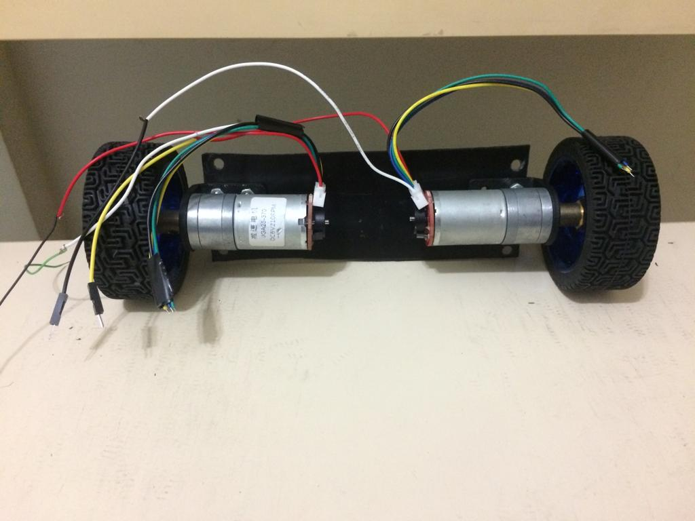

# Robo Equilibrista

### Projeto de um self-balance robot (robo equilibrista) para a pratica de tecnicas de controle moderno e processamento digital de sinais.

## Materiais utilizados

 - IMU MPU6050 [DATASHEET](https://www.invensense.com/products/motion-tracking/6-axis/mpu-6050/)

 - Arduino UNO R3 [WEBSITE](https://www.arduino.cc/)

 - Ponte H L298N [DATASHEET](https://www.st.com/en/motor-drivers/l298.html)

 - Prancheta de polietileno

 - Parafusos sem fim e porcas

 - Motores JGA25 com encoder 370 rpm

 - Jumpers e mini protoboard

## Objetivos

Os objetivos deste projeto são conceber, projetar, modelar matematicamente e controlar um robo que se equilibra em torno de um dos seus eixos , neste caso o eixo Y. O projeto foi concebido através de observações e consultas em estudos ja realizados e com sucesso a fim de se buscar uma estrutura estável para a atual finalidade e assim facilitando no controle e abrindo novas possibilidades como controlar movimentos do robo remotamente com um módulo bluetooth. O projeto apresenta as  característica de não linearidade e multiplas entradas multiplas saidas (MIMO) o que difuiculta a aplicacão de controles clássicos como o mais conhecido o PID, portanto neste estudo a finalidade principal é projetar um controlador [LQR](https://pt.wikipedia.org/wiki/Regulador_quadr%C3%A1tico_linear) para este sistema que juntamente com o [filtro de kalman](https://en.wikipedia.org/wiki/Kalman_filter), irá compor o controlador LQG. O projeto está divido em várias etapas, são elas motagem da estrutura, testes em malha aberta, aquisição de dados, projeto de um PID, modelagem matematica, projeto do controlador, testes finais e conclusões.

## Montagem da estrutura

## Testes em malha aberta
...
## Aquisição de dados
...
## Projeto PID
...
## Modelagem matemática
...
## Projeto LQR
...
## Testes finais
...
## Conclusões
...
 ## PROJETO EM ANDAMENTO...
